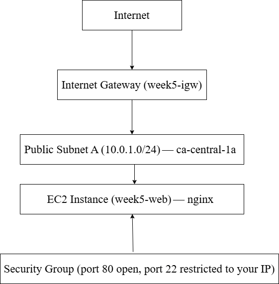
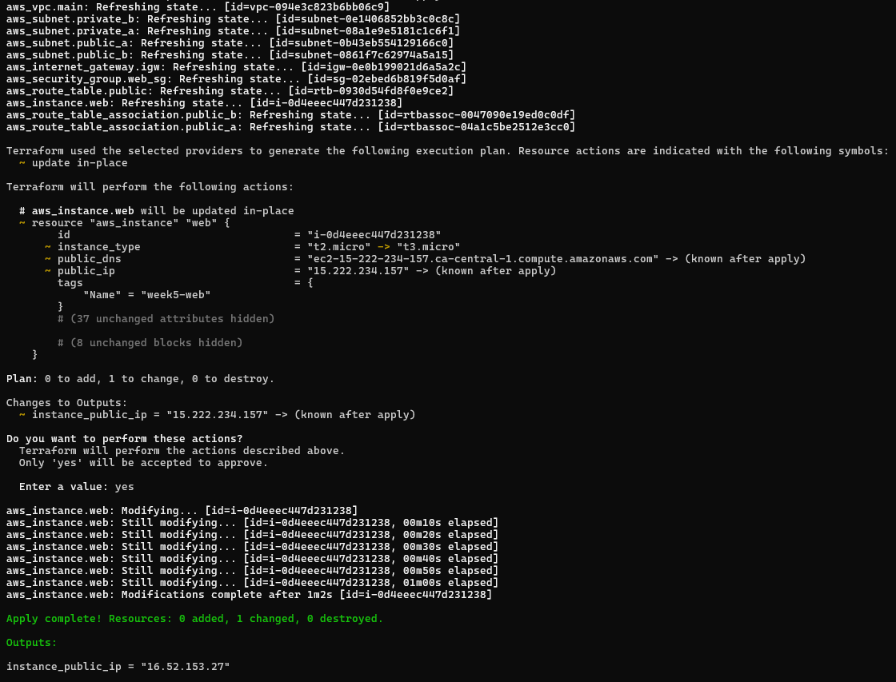
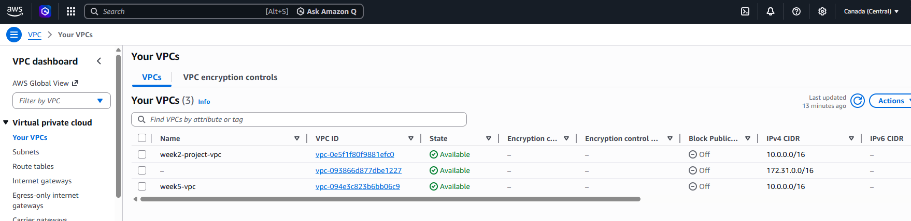
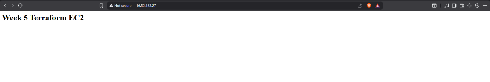
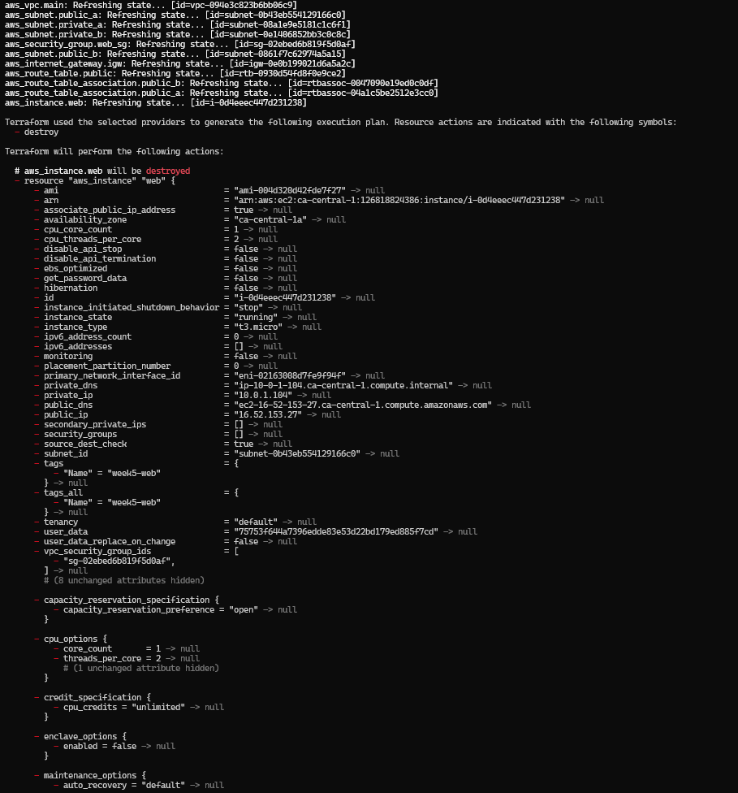

# AWS Week 5 - Infrastructure as Code with Terraform

---
## Overview

This project provisions AWS infrastructure using Terraform, replacing manual console-based setup with reproducible, version-controlled infrastructure.

The goal was to move from “click-based deployment” to a declarative infrastructure that can be created, modified, and destroyed consistently.

---
## Objective
- Define AWS infrastructure using Terraform  
- Eliminate manual configuration in the AWS Console  
- Enable repeatable and version-controlled deployments  
- Understand infrastructure lifecycle (provision → validate → destroy)

---

## Architecture
This system provisions a basic web infrastructure inside a custom VPC.

Traffic flow:
User → EC2 (public subnet) → nginx  



---

## Resource Provisioned

| Resoure | Name | Description |
|---|---|---|
| VPC | week5-vpc | Isolated network, 10.0.0.0/16 |
| Internet Gateway | femi-week5-igw | Public internet access |
| Public Subnet A | week5-public-a | ca-central-1a, auto-assigns public IP |
| Public Subnet B | week5-public-b | ca-central-1b |
| Private Subnet A | week5-private-a | ca-central-1a, no direct internet |
| Private Subnet B | week5-private-b | ca-central-1b, no direct internet |
| Route Table | week5-public-rt | Routes 0.0.0.0/0 to IGW |
| Security Group | week5-web-sg | HTTP open, SSH restricted to owner IP |
| EC2 Instance | week5-web | Amazon Linux 2023, t3.micro, nginx |

---

## Why Terraform Instead of the Console

Terraform improves infrastructure management in several ways:

• **Reproducibility** — infrastructure can be created consistently across environments  
• **Version control** — changes tracked through Git  
• **Collaboration** — configurations are shareable and reviewable  
• **Automation** — full lifecycle management (create, update, destroy)  

In contrast, manual console configuration:
- is error-prone  
- is difficult to track  
- does not scale well for teams  


---
## How to Run

### Prerequisites
- Terraform installed (`terraform -version`)
- AWS CLI configured (`aws sts get-caller-identity`)

### Deploy
# 1. Clone the repo
git clone https://github.com/AniStepBall/aws-week5-terraform-infra.git
cd aws-week5-terraform-infra

# 2. Create your tfvars (never committed — see .gitignore)
cp terraform.tfvars.example terraform.tfvars
Edit terraform.tfvars with your values

# 3. Initialise
terraform init

# 4. Preview changes
terraform plan

# 5. Deploy
terraform apply
```

After apply completes, the EC2 public IP is printed automatically:

Outputs:
> `instance_public_ip = "xx.xx.xx.xx"`

Open that IP in your browser to confirm the nginx page loads.

### Destroy
```bash
terraform destroy
```
All resources are automatically removed in the correct dependency order.

---
## Validation/Testing
To confirm correct deployment:

Verified VPC, subnets, and routing in AWS Console
Confirmed EC2 instance launched successfully
Accessed nginx page via public IP
Validated repeatability by re-running terraform apply


---
## Inputs

| Variable | Description | Default |
|---|---|---|
| `aws_region` | AWS region to deploy into | `ca-central-1` |
| `vpc_cidr` | VPC CIDR block | `10.0.0.0/16` |
| `instance_type` | EC2 instance type | `t3.micro` |
| `allowed_ssh_cidr` | Your IP for SSH access (no default — entered at runtime) | — |

---

## Outputs

| Output | Description |
|---|---|
| `instance_public_ip` | Public IP of the EC2 instance |


---
## Design Decisions and Tradeoffs

### No NAT Gateway

A NAT Gateway was intentionally omitted in this implementation to control cost and keep the architecture simple during development.

**Tradeoff:**
- Private subnets do not have outbound internet access  
- Limits ability to install updates or pull dependencies from external sources  

---

### Public EC2 Deployment

The EC2 instance is deployed in a public subnet for simplicity and direct access.

**Tradeoff:**
- Easier to access and validate deployment  
- Less secure compared to a private subnet + ALB architecture  

**Production approach:**
- Place EC2 instances in private subnets  
- Use an Application Load Balancer for inbound traffic  
- Restrict direct access to instances  

---

## Cost Considerations

To minimise cost in this environment:

- NAT Gateway is not provisioned (primary cost driver avoided)  
- EC2 instance uses a low-cost instance type (t3.micro)  

**Estimated impact:**
- Significant cost reduction compared to NAT-enabled architecture  

---

## Production Approach

In a production environment:

- Deploy a NAT Gateway in each Availability Zone  
- Configure private route tables to route `0.0.0.0/0` through the NAT Gateway  
- Place application instances in private subnets  
- Use an ALB for controlled public access  


---
## Screenshots

### terraform apply output


### AWS Console — VPC created by Terraform


### Browser — nginx page served from Terraform output IP


### terraform destroy output

> Enter the `screenshots` directory to see the full destroy sequence
---

## Repository Structure
```
aws-week5-terraform-infra/
├── providers.tf
├── variables.tf
├── terraform.tfvars.example  # Safe placeholder for collaborators
├── network.tf
├── security.tf
├── compute.tf
├── outputs.tf
├── .gitignore
├── diagrams/
├── screenshots/
└── README.md
```

## What I Learned
Infrastructure can be defined and version-controlled like code
Terraform enables consistent and repeatable deployments
Design decisions involve tradeoffs between cost, security, and complexity
Infrastructure lifecycle management is as important as deployment
